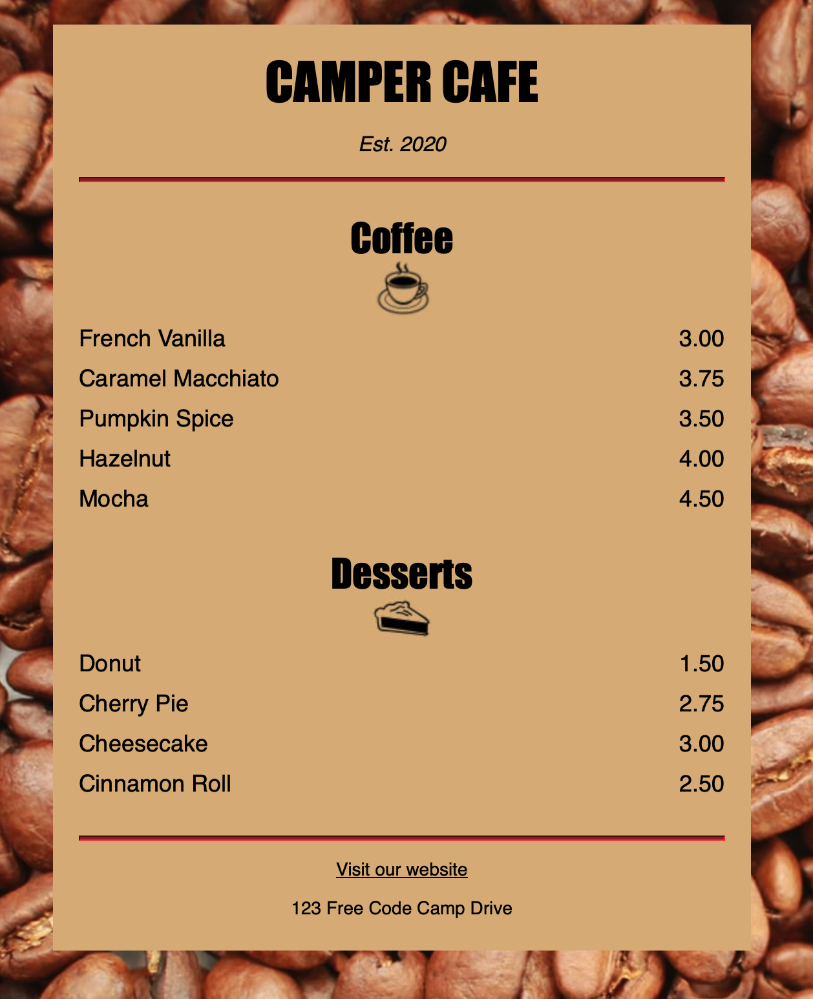

# ☕ Café Menu  

A simple café menu built with **HTML** and **CSS**, using semantic elements and basic styling.  

## 🚀 Technologies Used  
- **HTML5** – Semantic structure (`<section>`, `<article>`, `<ul>`)  
- **CSS3** – Basic typography and styling  

## 🎨 Screenshot  


## 🔗 Live Demo  
➡ [View the Project]https://cxcxkx.github.io/cafe-menu/

## 📂 Installation  
1. **Clone the repository:**  
   ```bash
   git clone https://github.com/cxcxkx/cafe-menu.git

